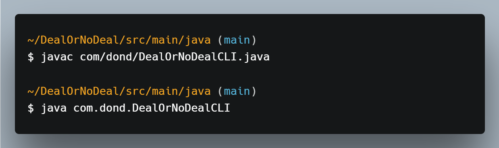
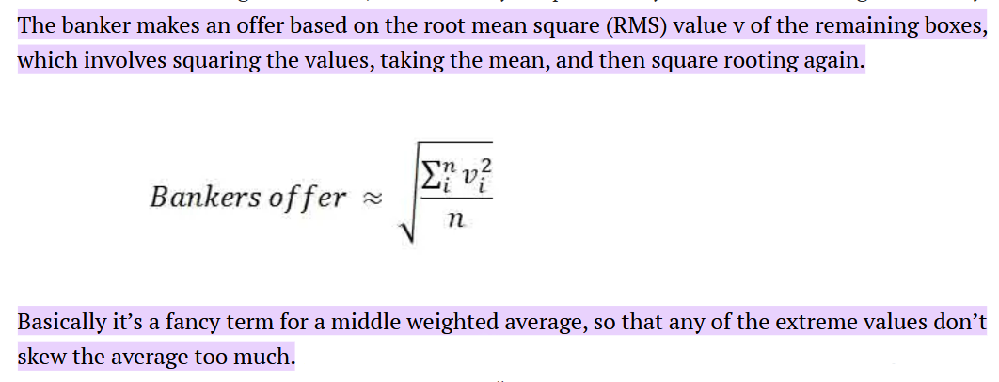
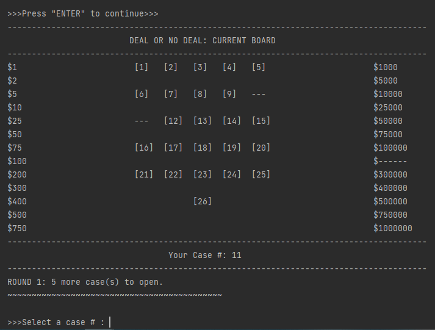
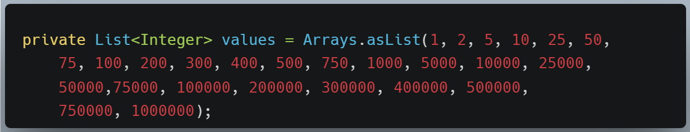
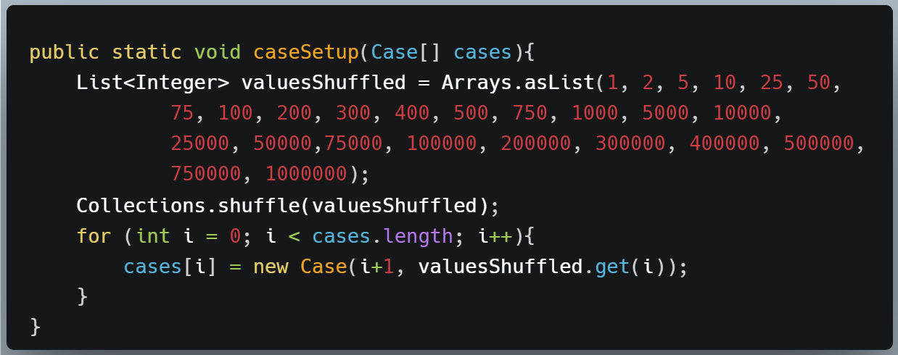

# DealOrNoDeal
This is a Java-powered CLI program that simulates the popular TV game show "Deal Or No Deal".

 

## Quick Set Up Instructions
Compile DealOrNoDeal.java, then execute the main method of the DealOrNoDealCLI class.

To run the program directly from the terminal window, route to the java directory and enter the following commands:

Note: JDK must be installed in order to compile from the terminal. Sound files are included in Resources. For the full gameplay experience with music and sound effects, compile and run the program by opening the pom.xl in your IDE.

 

## Program Structure
This project promotes the basic OOP principles of polymorphism and encapsulation.
 - application
    - Game: contains methods run(), setupGame(), startRound(), openCase(), updateGameBoard(), and dealAccepted()
    - SoundHandler: runMusic() reads in and starts an AudioInputStream
 - models
    - Banker: makeOffer() -- returns an offer price based on the following calculation:

    
    - Case: attributes caseNumber and caseValue are assigned at the beginning of the game. When a case is opened, the boolean isOpen is set to false.
        - getDispay() method returns "---" if case isOpen (to reflect on the gameboard) 
 - user interface
    - UserInput: reads in from a Scanner(System.in) and parses the user input
    - UserOutput: prints output to the console -- most notably through the printRules(), displayGameBoard(), and deliverOffer() methods

 

### The Game Board
The displayGameBoard() method of the UserOutput class prints the current game board to the console. The middle section of the board represents the 26 briefcases in the game, and the left and right columns represent the 26 potential cash values contained within the briefcases.

### Data Structures
To keep the cash values on the gameboard displayed in ascending order, I used two instance variables of the Game class: an array of 26 Cases ('cases') and a list of 26 integers ('values') containing the fixed cash value amounts:

At the start of the game, the values are shuffled, and each case in the 'cases' array is initialized by passing in a case number and shuffled value to the custom Case() constructor:

 

### Resources
- .wav music files include Intro theme, Outro theme, phone ringing effects, and deal/no deal effects. 

## How To Play
1. There are 26 briefcases on the board. Each case contains a hidden amount of cash between $1 
and $1 million. Values are shuffled and randomly assigned to each case at the start of the game.
2. Begin by choosing your briefcase. Choose wisely -- you will not open this case until the end of the game.
3. You will open the remaining cases in rounds. Each time you open a case, the cash amount inside 
will be revealed and removed from the board. The goal is to remove low value cases from the board.
4. After each round, the Banker will call you with an offer to purchase your case based on how much 
he believes it to be worth. You can accept the deal or decline and continue to the next round.
5. At the end of the game, we will open up your case and find out who got the best deal!

